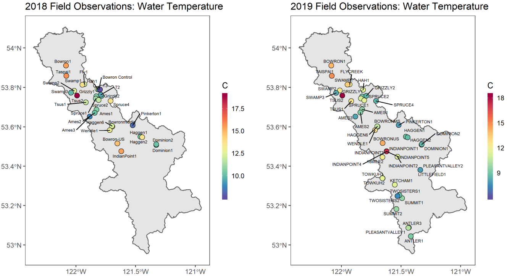
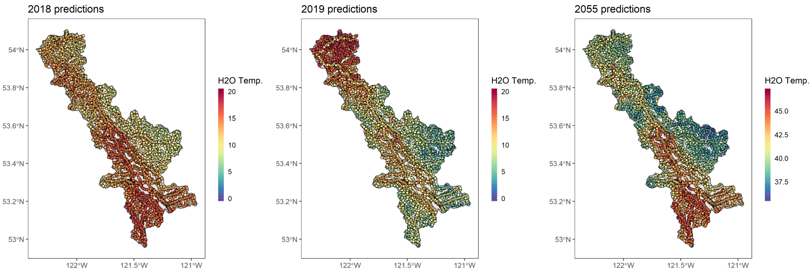

---
output:
  html_document:
    keep_md: yes
    variant: markdown_github
---


```r
knitr::opts_chunk$set(include=TRUE, echo = FALSE)
```

<a id="devex-badge" rel="Exploration" href="https://github.com/BCDevExchange/assets/blob/master/README.md"></a>

# Bowron Watershed Stream Temperature Modelling \n[openSTARS implementation]

This repository is preliminary workflow to model stream temperatures using [openSTARS](https://github.com/MiKatt/openSTARS) (an open source implementation of [STARS](https://www.fs.fed.us/rm/boise/AWAE/projects/SSN_STARS/software_data.html)) and [ssn](https://cran.r-project.org/web/packages/SSN/index.html).

### Preliminary Field Data

Field campaigns in 2018 and 2019 instrumentated stream locations with both water and air temperature sensors, and with relative humidity sensors. 

<div class="figure" style="text-align: center">

<p class="caption">...</p>
</div>

### Preliminary Predictions

Field data is used to predict stream temperatures for past, present, or future scenarios. 

<div class="figure" style="text-align: center">

<p class="caption">...</p>
</div>

### Project Status

This project is an active multi-year project. Each summer, new stream and air temperature records will be collected on the field and added to the model.

### Goals/Roadmap

Project is in active development and should not be considered ready for general usage. 
- Streamline implementation of openSTARS and SSN in northern British Columbia
- Develop high quality modelling of the Bowron Watershed
- Develop a general model for potential application elsewhere

### Getting Help or Reporting an Issue

To report bugs/issues/feature requests, please file an [issue](https://github.com/bcgov/bowron-ssn-openstars/issues/).

### How to Contribute

If you would like to contribute, please see our [CONTRIBUTING](CONTRIBUTING.md) guidelines.

Please note that this project is released with a [Contributor Code of Conduct](CODE_OF_CONDUCT.md). By participating in this project you agree to abide by its terms.

### License

```
Copyright 2018 Province of British Columbia

Licensed under the Apache License, Version 2.0 (the "License");
you may not use this file except in compliance with the License.
You may obtain a copy of the License at

http://www.apache.org/licenses/LICENSE-2.0

Unless required by applicable law or agreed to in writing, software distributed under the License is distributed on an "AS IS" BASIS,
WITHOUT WARRANTIES OR CONDITIONS OF ANY KIND, either express or implied.
See the License for the specific language governing permissions and limitations under the License.
```

---
*This project was created using the [bcgovr](https://github.com/bcgov/bcgovr) package.* 
